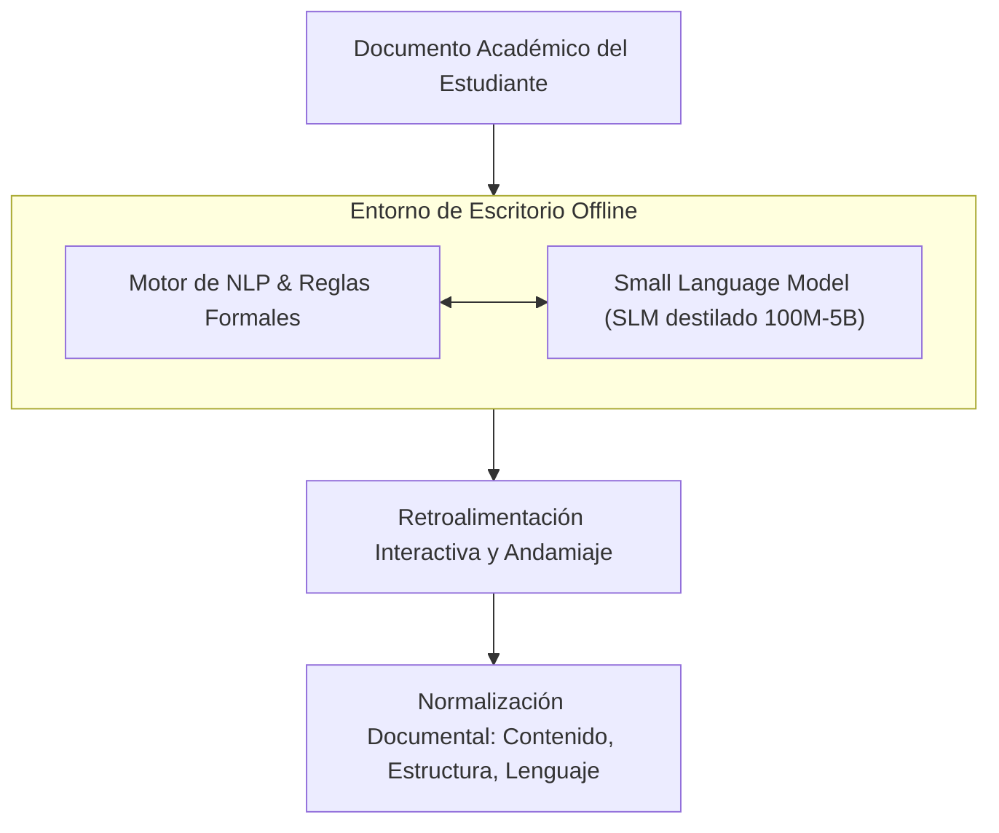

# Normalización de Documentos Académicos con IA Local (SLM)

> **Proyecto de Investigación:** Aplicación de escritorio basada en Inteligencia Artificial y su efecto en la normalización de documentos académicos en estudiantes universitarios, Lima 2026.
> **Autores:** Deyvi Oscar Sánchez Gonzales & Max Anderson Ttito Pomacanchari
> **Asesor:** Jhony Alex Zárate Bocanegra
> **Línea de Investigación:** Ciencia de Datos e Inteligencia Artificial (Universidad Autónoma del Perú)
> **Línea de Acción RSU:** Oportunidades Educativas para Todos

---

## 🎯 Resumen Ejecutivo

Este proyecto investiga cómo una **aplicación de escritorio local impulsada por Inteligencia Artificial (basada en Small Language Models - SLM y NLP)** impacta en la **normalización de documentos académicos** de estudiantes de Ingeniería de Software en Lima. Su propósito es actuar como un **andamiaje cognitivo** formativo que ayuda a corregir deficiencias de redacción, estructura y coherencia, resolviendo de forma directa las brechas de conectividad a internet en el contexto universitario peruano mediante la ejecución 100% offline.

---

## ⚖️ El Problema y la Oportunidad

| Contexto Problemático | Enfoque de Solución (Offline AI) |
| :--- | :--- |
| **Brechas en Escritura Académica:** Dificultades estructurales en planificación textual, organización de ideas, manejo de fuentes, aplicación de normas formales y altos índices de plagio no intencional por falta de instrucción. | **Andamiaje Cognitivo Automatizado:** Retroalimentación interactiva local que guía al estudiante en lugar de sustituir su proceso de aprendizaje. |
| **Brecha Digital y de Conectividad:** Alta dependencia de internet y costos elevados en modelos de IA en línea (como ChatGPT/APIs públicas) en Lima Metropolitana. | **Modelos de Lenguaje Pequeños (SLMs):** Arquitecturas de 100M a 5B parámetros optimizadas para correr localmente en la computadora del alumno sin conexión. |

---

## 🔬 Diseño Metodológico

El estudio está estructurado bajo un enfoque científico riguroso para medir de forma causal el impacto de la herramienta:

* **Enfoque:** Cuantitativo, secuencia probatoria y medición objetiva.
* **Tipo:** Aplicada (orientada a resolver una problemática real mediante desarrollo de software).
* **Nivel:** Explicativo causal (busca demostrar una relación de causa-efecto).
* **Diseño:** Cuasi-experimental con **grupo único pretest y postest** (grupos intactos preexistentes).
* **Población:** Estudiantes de Ingeniería de Software de la Universidad Autónoma del Perú (2026).
* **Muestra:** Mínimo **67 estudiantes** (calculado con nivel de confianza del 95%, margen de error del 12% por naturaleza exploratoria y alta homogeneidad).
* **Intervención:** 4 semanas de uso continuo de la aplicación de escritorio.

---

## 📐 Operacionalización de Variables

El proyecto evalúa la interacción de dos variables clave, correlacionando las capacidades de la IA con la calidad de los documentos producidos:

### 1. Variable Independiente: Aplicación de Escritorio con IA Local
*Definición: Sistema informático offline que integra un SLM destilado con NLP y reglas formales para guiar en la normalización.*

| Dimensión | Indicadores | Instrumento de Medición |
| :--- | :--- | :--- |
| **Organización** | • Sugerencia de estructura del documento • Organización de ideas en párrafos • Ordenamiento de secciones académicas | Cuestionario estructurado (9 ítems) en Escala de Likert (1 al 5) |
| **Coherencia** | • Mejora de la cohesión textual • Sugerencia de conectores lógicos académicos • Revisión del flujo del discurso |
| **Gramática** | • Detección de errores gramaticales • Sugerencia de correcciones sintácticas • Validación de normativa lingüística académica |

### 2. Variable Dependiente: Normalización de Documentos Académicos
*Definición: Proceso mediante el cual un documento se ajusta a las convenciones formales de contenido, organización y uso del lenguaje.*

| Dimensión | Indicadores | Instrumento de Medición |
| :--- | :--- | :--- |
| **Contenido** | • Desarrollo de ideas principales • Relevancia del contenido al tema académico • Profundidad argumentativa | Cuestionario estructurado (9 ítems) en Escala de Likert (1 al 5) |
| **Organización** | • Estructura del documento • Jerarquía de secciones académicas • Formato académico normalizado (APA/etc.) |
| **Uso del Lenguaje** | • Corrección gramatical académica • Precisión léxica académica • Estilo académico apropiado |

---

## 🧪 Hipótesis del Estudio

* **Hipótesis General ($H_1$):** La aplicación de escritorio basada en inteligencia artificial produce un efecto positivo y significativo en la normalización de documentos académicos en estudiantes universitarios, Lima 2026.
* **Hipótesis Específica 1 ($HE_1$):** Produce un efecto positivo y significativo en el **Contenido** de los documentos.
* **Hipótesis Específica 2 ($HE_2$):** Produce un efecto positivo y significativo en la **Organización** de los documentos.
* **Hipótesis Específica 3 ($HE_3$):** Produce un efecto positivo y significativo en el **Uso del lenguaje** de los documentos.

---

## 🛠️ Arquitectura Conceptual de la Aplicación

---

## 💎 Justificación e Impacto

1. **Relevancia Social:** Democratiza el acceso a herramientas avanzadas de IA para estudiantes con conectividad limitada o nula, eliminando barreras socioeconómicas.
2. **Valor Teórico:** Vincula la teoría socioconstructivista del andamiaje cognitivo con la viabilidad práctica de los Small Language Models (SLMs) aplicados a la educación en Latinoamérica.
3. **Utilidad Metodológica:** Proporciona un modelo riguroso de evaluación cuantitativa cuasi-experimental (pretest/postest) adaptable a otras tecnologías educativas.
